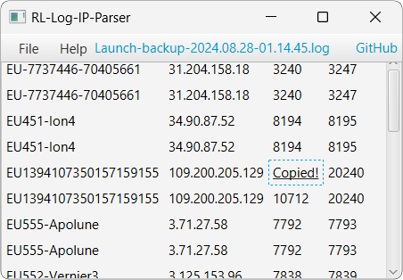

# Rocket-League-IP-Parser
 Finds the IP and server name of a Rocket League server using the game's log files.
  
 Requires Java 8
 
 
 
 * Go to **File > Open** and select a Rocket League log file (Usually named "Launch.log")
 * Default Rocket League log file location: **\Documents\My Games\Rocket League\TAGame\Logs**
 * Click a server name or IP to copy it to your clipboard

**Notes:**
* Server name (left column)
* Server IP (right column)
 
 

