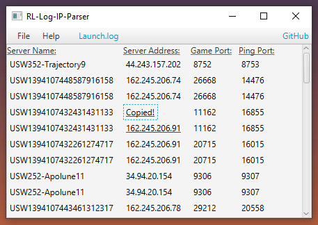

# Rocket-League-IP-Parser
 Finds the server name, IP, game port, and ping port of a Rocket League server using the game's log files.
  
 Requires Java 8
 
 
 
 * Go to **File > Open** and select a Rocket League log file (Usually named "Launch.log")
 * Default Rocket League log file location: **\Documents\My Games\Rocket League\TAGame\Logs**
 * Click a server name, IP, or port to copy it to your clipboard

**Notes:**
* Server name (first column)
* Server IP (second column)
* Server port (third column)
* Server ping port (fourth column)
 
 

